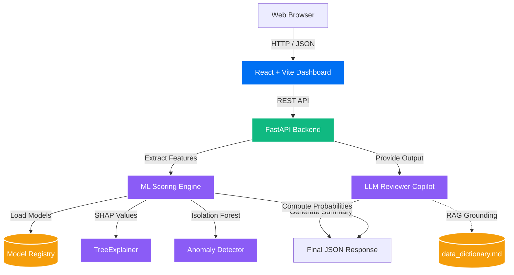

# Loan Performance Intelligence Engine 🚀

This repository contains the complete submission for the **Intain Campus FinTech Challenge 2026 AI Track**.

The **Loan Performance Intelligence Engine (LPIE)** is an ML-first, agentically-developed AI platform designed to profile, predict, simulate, and explain loan-level risk performance. It moves beyond simple LLM wrappers by implementing a robust data science pipeline, time-aware cross-validation, and multi-outcome predictive modeling, coupled with a grounded LLM Reviewer Copilot.

---

## 📖 Table of Contents
1. [Architecture Overview](#architecture-overview)
2. [Quickstart & Running the App](#quickstart--running-the-app)
3. [Hackathon Deliverables Checklist](#hackathon-deliverables-checklist)
4. [Machine Learning Pipeline](#machine-learning-pipeline)
5. [Advanced Intelligence Modules](#advanced-intelligence-modules)
6. [LLM Reviewer Copilot](#llm-reviewer-copilot)

---

## 🏗️ Architecture Overview

The system is built on a modern, decoupled architecture:



### Component Details
*   **Frontend**: React + Vite UI Dashboard for Loan Assessors.
*   **Backend**: High-performance FastAPI server.
*   **ML Engine**: Scikit-learn, XGBoost, and LightGBM models serialized into a versioned registry.
*   **Explainability**: SHAP (SHapley Additive exPlanations) for global and local attributions.
*   **LLM Layer**: LangChain based RAG Copilot strictly grounded to the `data_dictionary.md`.

---

## ⚙️ Quickstart & Running the App

The entire application is fully containerized for reproducible execution.

### Prerequisites
- Docker & Docker-Compose installed

### Launching the Platform
```bash
# 1. Clone the repository
git clone https://github.com/<YOUR-USERNAME>/loan-performance-intelligence-engine.git
cd loan-performance-intelligence-engine

# 2. Build and run the containers
docker-compose up --build
```

### Accessing the Interfaces
- **Frontend Dashboard**: Navigate to [http://localhost:3000](http://localhost:3000)
- **Backend API & Swagger Docs**: Navigate to [http://localhost:8000/docs](http://localhost:8000/docs)

*(Note: Raw `.zip` data and heavy intermediate `.parquet` features have been `.gitignore`'d to respect GitHub size constraints. However, all versioned models are included in `/models/` allowing the API to run inference immediately).*

---

## 🎯 Hackathon Deliverables Checklist

All core deliverables have been fulfilled and generated inside this repository:

| Deliverable | Location | Description |
| :--- | :--- | :--- |
| **Complete Source Code** | `INTAIN_MAAZ/` | Root repository containing all ML, Backend, and UI modules. |
| **Reproducible Scripts** | `ml/data_pipeline/`, `ml/training/` | End-to-end extraction, feature engineering, and training pipeline. |
| **Submission CSV** | [`submission/submission.csv`](submission/submission.csv) | Final scoring outputs containing probabilities, states, and anomalies. |
| **Data Intelligence Report** | [`reports/data_intelligence_report.md`](reports/data_intelligence_report.md) | Profiling, missingness, and relationship checks. |
| **Model Card** | [`reports/model_card.md`](reports/model_card.md) | Architecture, validation methodology, and metrics (ROC-AUC, PR-AUC). |
| **Explainability Report** | [`reports/explainability_report.md`](reports/explainability_report.md) | Global feature importance and local SHAP logic. |
| **Scenario Report** | [`reports/scenario_report.md`](reports/scenario_report.md) | Portfolio simulation outputs (Base, Adverse, Prepayment). |
| **AI Development Log** | [`reports/AI_development_log.md`](reports/AI_development_log.md) | Documentation of agentic tools, prompts, and lessons learned. |

---

## 🔬 Machine Learning Pipeline

### 1. Time-Aware Validation
To prevent target leakage, we strictly avoided random cross-validation. The dataset (~250k-1M rows) was chronologically split:
- **Training Set**: Vintages/Months up to chronological boundary.
- **Validation Set**: Temporal window following training.
- **Test Set**: Strictly out-of-time (OOT) holdout for final scoring.

### 2. Multi-Target Models
Instead of a single binary classifier, we train specialized models across multiple horizons:
*   **3-Month Delinquency**: Random Forest (ROC-AUC: 0.916)
*   **6-Month Delinquency**: Random Forest (ROC-AUC: 0.886)
*   **12-Month Default**: Random Forest (ROC-AUC: 0.955)
*   **12-Month Prepayment**: XGBoost
*   **Next-State Transition**: LightGBM Multi-class Classifier (91.5% Accuracy)

---

## 🧠 Advanced Intelligence Modules

### Anomaly Detection (Two-Layer System)
1.  **Deterministic Rules**: Hard rules (`validation_rules.json`) capturing structural impossibilities (e.g., negative balances).
2.  **Machine Learning (Isolation Forest)**: Captures statistically unusual combinations of features that bypass hard rules.

### Scenario Simulation
A custom `PortfolioSimulator` engine that applies macro-economic shocks (`macro_scenarios.csv`):
*   **Adverse-Credit Scenario**: Simulates unemployment spikes (+300bps) and HPI drops (-15%).
*   **High-Prepayment Scenario**: Simulates interest rate drops (-150bps).

### Survival Modeling
Implemented `DiscreteTimeSurvivalModel` (`ml/survival_model.py`) using proportional hazards mapped across discrete monthly transitions to generate cumulative event curves.

---

## 🤖 LLM Reviewer Copilot

The platform features an **LLM-Assisted Reviewer Copilot** accessible via the React frontend.
*   **Grounding**: The LLM is strictly constrained via Retrieval-Augmented Generation (RAG) against `data_dictionary.md` and `validation_rules.json`.
*   **Governance**: The LLM *cannot* make predictions. It only parses the outputs of the XGBoost/Isolation Forest models to generate human-readable summaries for the human-in-the-loop reviewer.

---
*Built for the Intain Campus FinTech Challenge 2026 AI Track.*
