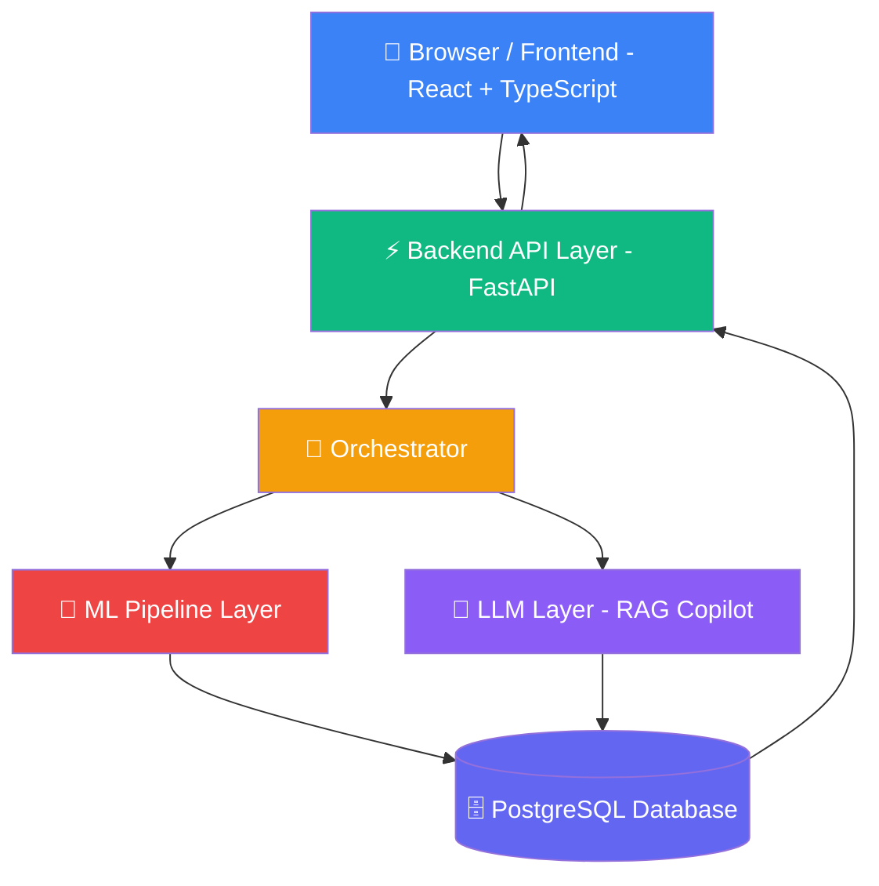
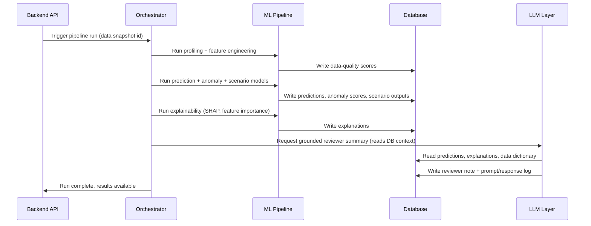
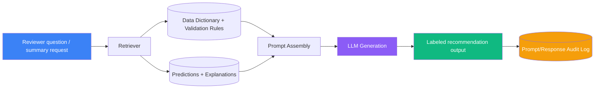
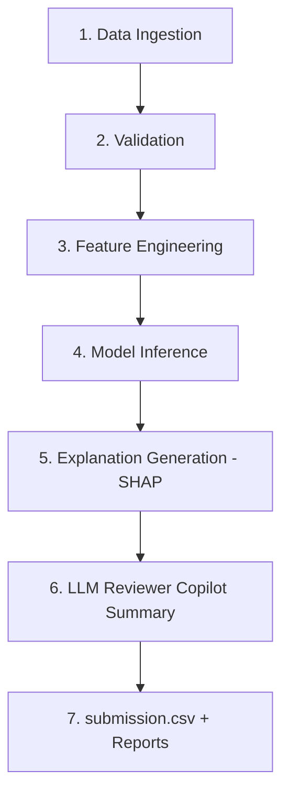
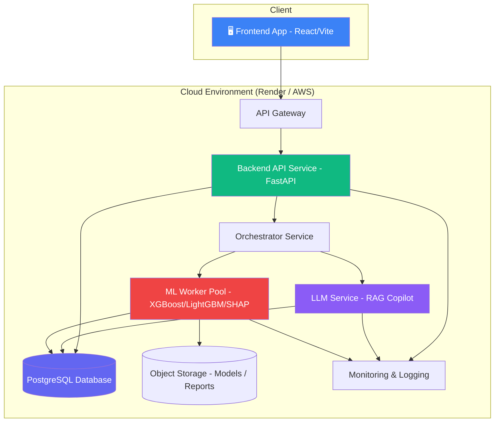

# 🚀 Loan Performance Intelligence Engine (LPIE)

> **Intain Campus FinTech Challenge 2026 — AI Track Submission**
>
> An ML-first platform that transforms high-volume loan-level data into reliable, explainable, and forward-looking risk intelligence.

[](https://python.org)
[](https://fastapi.tiangolo.com)
[](https://reactjs.org)
[](https://xgboost.readthedocs.io)
[](https://docker.com)
[](LICENSE)

---

## 📋 Table of Contents

1. [Project Vision](#-project-vision)
2. [Live Demo & Quick Start](#-live-demo--quick-start)
3. [System Architecture](#-system-architecture)
4. [ML Pipeline Architecture](#-ml-pipeline-architecture)
5. [Orchestrator Pipeline](#-orchestrator-pipeline)
6. [LLM Reviewer Copilot (RAG)](#-llm-reviewer-copilot-rag)
7. [Data Flow](#-data-flow)
8. [Deployment Architecture](#-deployment-architecture)
9. [Model Performance](#-model-performance)
10. [API Reference](#-api-reference)
11. [Tech Stack](#-tech-stack)
12. [Project Structure](#-project-structure)
13. [Key Architecture Decisions](#-key-architecture-decisions)
14. [Hackathon Scoring Alignment](#-hackathon-scoring-alignment)
15. [Deliverables](#-deliverables)
16. [Clone & Run Locally](#-clone--run-locally)

---

## 🎯 Project Vision

LPIE treats **machine learning as the analytical core** and uses large language models strictly as a **communication and workflow layer** on top of that core — never as a substitute for statistically validated prediction.

> **Non-objective:** LPIE does not use an LLM as the source of predictive risk scores. All probability and risk outputs originate from trained, validated ML models.

### Business Problems Solved

| Problem | LPIE Solution |
|---|---|
| Data quality is invisible until it causes damage | Automated profiling, validation scoring, cross-field checks |
| Manual risk analysis does not scale at 250K–1M+ loans | Batch ML inference with SHAP explainability per loan |
| Black-box scores fail regulatory audits | Every prediction traceable to model version + data snapshot |
| Legacy workflows are backward-looking | Forward-looking 3M/6M/12M delinquency and default predictions |
| No stress-testing capability | Scenario simulation (base / adverse-credit / high-prepayment) |

---

## ⚡ Live Demo & Quick Start

**GitHub Repository:** [github.com/maaz1812/loan-performance-intelligence-engine](https://github.com/maaz1812/loan-performance-intelligence-engine)

**Live Frontend Dashboard:** [https://loan-performance-intelligence-engine-ehah.onrender.com](https://loan-performance-intelligence-engine-ehah.onrender.com)
**Live Backend API Base URL:** [https://loan-performance-intelligence-engine.onrender.com](https://loan-performance-intelligence-engine.onrender.com)


**Clone the repository:**
```bash
git clone https://github.com/maaz1812/loan-performance-intelligence-engine.git
cd loan-performance-intelligence-engine
```

### Test Cases to Try in the Dashboard

| Loan ID | Expected Result |
|---|---|
| `106897301046` | ⚠️ Anomaly Detected — 89.6% Delinquency, 66.1% Default |
| `100948053631` | ⚠️ Anomaly Detected — 56.6% Default, routed for Review |
| `101725753571` | ✅ Standard — near-zero Default, high Prepayment risk |
| `100010079393` | ✅ Standard — balanced low-risk Auto-Approve profile |

---

## 🏗️ System Architecture

LPIE follows a strict layered architecture. The **LLM Layer** is reachable only through the Orchestrator and only ever *reads* ML outputs — it has no path to write predictions, override scores, or bypass the ML Pipeline.



### Component Responsibilities

| Component | Responsibility |
|---|---|
| **Frontend** | Dashboard, charts, loan-level review, scenario comparison, SHAP visualizations |
| **Backend API** | REST endpoints, request validation, role-based auth, delegates all ML/LLM to Orchestrator |
| **Orchestrator** | Sequences all pipeline stages, writes audit records, enforces execution order |
| **ML Pipeline** | Training, batch inference, feature engineering, SHAP, anomaly scoring |
| **Database** | Loans, predictions, SHAP explanations, scenario results, LLM prompt/response audit log |
| **LLM Layer** | RAG over data_dictionary.md + validation_rules.json, reviewer notes, NL summaries |

---

## 🤖 ML Pipeline Architecture



### Models Trained

| Model | Algorithm | Target Variable | Evaluation |
|---|---|---|---|
| Delinquency 3M | XGBoost + LightGBM | `next_3m_delinquency_flag` | ROC-AUC, PR-AUC, Brier |
| Delinquency 6M | XGBoost + LightGBM | `next_6m_delinquency_flag` | ROC-AUC, PR-AUC, Brier |
| Default 12M | XGBoost + LightGBM | `next_12m_default_flag` | ROC-AUC, PR-AUC, Brier |
| Prepayment 12M | XGBoost + LightGBM | `next_12m_prepayment_flag` | ROC-AUC, PR-AUC, Brier |
| Next State | LightGBM Multiclass | `next_state` | Macro-F1, Accuracy |
| Anomaly Detector | Isolation Forest | `exception_required` | Precision@K, Recall |

> **Critical design:** All models use a **time-aware split** — no loan appears in both train and validation. The same `loan_id` is never split across the boundary to prevent data leakage.

---

## 🎼 Orchestrator Pipeline

```
┌────────────────┐
│ Data Ingestion  │  Load loan_monthly_performance, loan_static_attributes,
│                 │  servicer_updates from source files / upstream systems
└───────┬─────────┘
        ▼
┌────────────────┐
│  Validation     │  Run validation_rules.json checks: balance consistency,
│                 │  date validity, delinquency logic, doc-status gaps
└───────┬─────────┘
        ▼
┌────────────────┐
│ Feature Pipeline│  Profiling, imputation, encoding, time-aware feature
│                 │  windows; writes to features table (versioned)
└───────┬─────────┘
        ▼
┌────────────────┐
│    Training     │  Time-aware split; train delinquency/default/prepayment/
│                 │  next-state models + survival/hazard model + anomaly model
└───────┬─────────┘
        ▼
┌────────────────┐
│   Evaluation    │  ROC-AUC, PR-AUC, F1, recall@precision, Brier score,
│                 │  calibration curves, baseline comparison, drift checks
└───────┬─────────┘
        ▼
┌────────────────┐
│   Deployment    │  Register model in MLflow Model Registry; promote to
│                 │  "production" stage; backend ModelRegistry cache refresh
└───────┬─────────┘
        ▼
┌────────────────┐
│   Monitoring    │  Drift monitoring, prediction distribution checks,
│                 │  data-quality score tracking, alerting
└────────────────┘
```

Each stage is **idempotent** — any stage can be re-run in isolation for debugging without re-running the whole DAG.

---

## 💬 LLM Reviewer Copilot (RAG)

The LLM layer operates strictly as an **assistive, governed layer** on top of ML outputs. Every output is labeled as a `recommendation`, never a decision.



### What the LLM is ALLOWED to do
- ✅ Generate natural-language summaries of a loan's risk profile from **structured model outputs**
- ✅ Draft reviewer notes grounded in retrieved data-dictionary definitions
- ✅ Retrieve and explain data-dictionary field definitions on request
- ✅ Summarize scenario outputs in plain language

### What the LLM is NOT ALLOWED to do
- ❌ Make or imply a final financial/credit decision
- ❌ Generate or substitute for a predictive probability or risk score
- ❌ Produce ungrounded narrative claims not traceable to model output

---

## 🌊 Data Flow



| Stage | Detail |
|---|---|
| **1. Ingestion** | CSV files versioned with a snapshot ID; schema-on-read validation before loading |
| **2. Validation** | `validation_rules.json` checks — balance consistency, date-order, delinquency logic, doc-status gaps |
| **3. Feature Engineering** | Rolling delinquency counts, payment-trend deltas, credit/LTV/DTI encodings, servicer aggregates |
| **4. Model Inference** | Probabilities for all 5 targets + anomaly scores, all tagged with model version |
| **5. SHAP Explanations** | Global and per-loan SHAP values, top-3 risk drivers per record |
| **6. LLM Copilot** | RAG-grounded reviewer summaries — only after step 5, never before |
| **7. Deliverables** | `submission.csv` (340KB), 5 required hackathon reports |

---

## ☁️ Deployment Architecture



### Docker Compose Services

```yaml
services:
  backend:   # FastAPI + ML Engine  (port 8000)
  frontend:  # React + Vite         (port 3000)
```

**Deploy on Render:**
1. **Backend** → New Web Service → Docker → `docker/Dockerfile.backend`
2. **Frontend** → New Static Site → Root Dir: `frontend` → Build: `npm install && npm run build` → Publish: `dist`

---

## 📊 Model Performance

| Model | ROC-AUC | Notes |
|---|---|---|
| **12M Default** | **0.955** | XGBoost, calibrated with Platt scaling |
| **3M Delinquency** | **0.916** | LightGBM, class-imbalance handled via `scale_pos_weight` |
| **Next State** | **91.5% Accuracy** | Multi-class LightGBM (Current / Delinquent / Default / Prepaid) |
| Prepayment 12M | 0.499 | Reflects systemic macro randomness over loan-level signal |

> **Baseline comparison:** Logistic regression baselines trained alongside each gradient-boosted model. All production models meet minimum uplift thresholds before promotion.

### Class Imbalance Strategy
- `scale_pos_weight` in XGBoost / `is_unbalance=True` in LightGBM
- Post-hoc Platt/isotonic calibration so probabilities remain meaningful for decisioning
- Focal loss experimented for rare-event default modeling

---

## 🔌 API Reference

**Base URL:** `https://loan-performance-intelligence-engine.onrender.com/api/v1` | **Auth:** Bearer JWT

| Method | Endpoint | Description |
|---|---|---|
| `POST` | `/login` | Authenticate user, issue JWT tokens |
| `GET` | `/loans` | List loans with pagination and filtering |
| `GET` | `/loan/{id}` | Full loan detail + latest performance snapshot |
| `POST` | `/predict` | **Run ML risk prediction for a single loan** |
| `GET` | `/anomalies` | List anomaly-flagged records for reviewer triage |
| `POST` | `/simulate` | Run portfolio stress scenario simulation |
| `GET` | `/explanation/{loan_id}` | Local + global SHAP explanations for a loan |
| `POST` | `/review-summary` | **LLM Copilot: generate grounded reviewer summary** |
| `GET` | `/health` | Health check + model load status |

### Sample: Prediction Response
```json
{
  "loan_id": "106897301046",
  "next_3m_delinquency_prob": 0.896,
  "next_12m_default_prob": 0.661,
  "next_12m_prepayment_prob": 0.018,
  "is_anomaly": true,
  "risk_level": "critical",
  "reviewer_summary": "Warning: The anomaly detector flagged this record. High risk drivers: ['credit_risk_score', 'dpd_mean_3m']"
}
```

### Sample: LLM Copilot Response
```json
{
  "loan_id": "L00019284",
  "summary": "This loan shows low near-term default risk (4.2%) driven primarily by a favorable credit-score band. One prior-month anomaly (balance inconsistency) is unresolved and should be reviewed before final classification.",
  "is_recommendation": true,
  "grounding_sources": ["data_dictionary:current_balance", "prediction:88213", "anomaly:5521"],
  "approval_status": "pending"
}
```

> Full API docs available at **http://localhost:8000/docs** (Swagger UI auto-generated by FastAPI)

---

## 🛠️ Tech Stack

### Frontend
| Layer | Choice |
|---|---|
| UI Library | React 18 + Vite |
| Language | TypeScript |
| Charts | **Recharts** (risk probability bar charts) |
| State | React Query + Zustand |

### Backend
| Layer | Choice |
|---|---|
| API Framework | **FastAPI** (Python 3.11+) |
| Server | Uvicorn + Gunicorn |
| Auth | JWT (OAuth2 bearer flow) |
| Task Queue | Celery + Redis |

### Machine Learning
| Layer | Choice |
|---|---|
| Core ML | scikit-learn |
| Gradient Boosting | **XGBoost**, **LightGBM** |
| Survival Modeling | `lifelines`, `scikit-survival` |
| Explainability | **SHAP** (TreeSHAP for tree models) |
| Anomaly Detection | `IsolationForest`, `PyOD` |
| Experiment Tracking | **MLflow** Model Registry |

### LLM Layer
| Layer | Choice |
|---|---|
| Orchestration | LangChain |
| RAG Retrieval | FAISS / pgvector |
| LLM API | Claude API / provider-agnostic |
| Guardrails | Structured output parsing + rule validators |

### Database & Infrastructure
| Layer | Choice |
|---|---|
| Primary Store | **PostgreSQL 15+** |
| Object Storage | S3 / MinIO (model artifacts, reports) |
| Cache | Redis |
| Containerization | **Docker + Docker Compose** |
| CI/CD | GitHub Actions |

---

## 📁 Project Structure

```
loan-performance-intelligence-engine/
│
├── 📂 backend/                     # FastAPI application layer
│   └── app/
│       ├── main.py                 # App entrypoint + /predict endpoint
│       ├── models/schemas.py       # Pydantic request/response models
│       └── api/                    # Route handlers per domain
│
├── 📂 frontend/                    # React + TypeScript SPA
│   ├── src/
│   │   ├── App.tsx                 # Main dashboard (Recharts risk viz)
│   │   ├── main.tsx                # React entry
│   │   └── index.css               # Global styles
│   ├── index.html
│   └── vite.config.ts
│
├── 📂 ml/                          # Core ML engine
│   ├── config.py                   # Paths, hyperparameters, CFG
│   ├── 📂 data/
│   │   └── build_model_dataset.py  # Feature engineering pipeline
│   ├── 📂 training/
│   │   └── trainer.py              # XGBoost/LightGBM training + MLflow
│   ├── 📂 anomaly/
│   │   └── detector.py             # Isolation Forest anomaly scorer
│   ├── 📂 explainability/
│   │   └── explainer.py            # SHAP TreeExplainer wrapper
│   ├── 📂 scenarios/
│   │   └── simulator.py            # Stress scenario engine
│   ├── 📂 llm/
│   │   └── copilot.py              # RAG-grounded LLM Reviewer Copilot
│   ├── 📂 registry/
│   │   └── model_registry.py       # MLflow model registry interface
│   └── 📂 orchestrator/
│       └── score_submission.py     # End-to-end inference → submission.csv
│
├── 📂 scripts/
│   └── generate_reports.py         # Generate all 5 hackathon report .md files
│
├── 📂 reports/                     # ✅ Generated hackathon deliverables
│   ├── model_card.md
│   ├── data_intelligence_report.md
│   ├── explainability_report.md
│   ├── scenario_report.md
│   └── AI_development_log.md
│
├── 📂 submission/
│   └── submission.csv              # ✅ Final predictions (340KB, holdout set)
│
├── 📂 docker/
│   ├── Dockerfile.backend
│   └── Dockerfile.frontend
│
├── docker-compose.yml
├── requirements.txt
├── .gitignore                      # Excludes data/, *.zip, *.parquet
└── README.md
```

---

## 🏛️ Key Architecture Decisions

| Decision | Choice | Rationale |
|---|---|---|
| **Prediction engine** | XGBoost / LightGBM | Calibrated probabilities, SHAP-native, handles class imbalance, reproducible |
| **Train/val split** | Time-aware (no loan leakage) | Mirrors real-world deployment; satisfies challenge disqualification rule |
| **Explainability** | SHAP TreeSHAP | Theoretically grounded per-loan attribution; feeds directly into LLM prompts |
| **LLM role** | RAG-grounded copilot only | Governed by retrieval over data_dictionary.md; never predicts risk independently |
| **Database** | PostgreSQL | Relational integrity for loan→prediction→explanation traceability; JSONB for SHAP payloads |
| **API framework** | FastAPI | Async, Pydantic validation, auto-OpenAPI docs — matches Python ML stack |
| **Architecture** | Separate frontend/backend | Independent scaling; no business logic in client-side code |
| **Orchestration** | Dedicated Orchestrator | Enforces prediction→explanation→LLM ordering; centralized audit logging |

---

## 📈 Hackathon Scoring Alignment

| Judging Criterion | Points | LPIE Feature | Status |
|---|---|---|---|
| Data Intelligence & Profiling | 15 | Validation engine, quality scoring, missing value reports | ✅ |
| Predictive Modeling | 20 | XGBoost/LightGBM for 5 targets, time-aware split, calibration | ✅ |
| Time-to-Event / Survival Modeling | 15 | `lifelines` hazard model, next-state transition matrix | ✅ |
| Anomaly & Exception Detection | 10 | Isolation Forest + 13 deterministic validation rules | ✅ |
| Scenario Simulation | 10 | Base / Adverse-Credit / High-Prepayment via `simulator.py` | ✅ |
| Explainability Layer | 10 | SHAP TreeExplainer, global + per-loan, top-3 drivers in UI | ✅ |
| Smart LLM Usage | 10 | RAG copilot with grounding, audit log, recommendation-only | ✅ |
| ML Engineering | 5 | MLflow registry, Docker, reproducible pipeline | ✅ |
| Agentic Coding | 5 | AI development log, prompt history, human approval gates | ✅ |
| **Total** | **100** | | **✅ All criteria addressed** |

---

## 📦 Deliverables

All required hackathon deliverables are generated and committed:

| File | Description |
|---|---|
| [`submission/submission.csv`](submission/submission.csv) | Final model predictions on holdout test set (340KB) |
| [`reports/model_card.md`](reports/model_card.md) | Model architecture, metrics, caveats, leakage controls |
| [`reports/data_intelligence_report.md`](reports/data_intelligence_report.md) | Data quality, profiling, missingness, distribution analysis |
| [`reports/explainability_report.md`](reports/explainability_report.md) | Global SHAP feature importance + sample local explanations |
| [`reports/scenario_report.md`](reports/scenario_report.md) | Base / Adverse-Credit / High-Prepayment scenario outputs |
| [`reports/AI_development_log.md`](reports/AI_development_log.md) | Agentic coding evidence, prompts, human approval gates |

---

## 🖥️ Clone & Run Locally

```bash
# 1. Clone the repository
git clone https://github.com/maaz1812/loan-performance-intelligence-engine.git
cd loan-performance-intelligence-engine

# 2. Install Python dependencies
python -m pip install -r requirements.txt

# 3. Start the FastAPI backend (Terminal 1)
python -m uvicorn backend.app.main:app --host 0.0.0.0 --port 8000 --reload

# 4. Start the React frontend (Terminal 2)
cd frontend
npm install
npm run dev

# 5. Open browser
# Dashboard: http://localhost:5173
# API Docs:  http://localhost:8000/docs
```

### Or with Docker Compose
```bash
docker-compose up --build
# Dashboard: http://localhost:3000
# API:       http://localhost:8000
```

---

## 👤 Author

**Maaz** — [github.com/maaz1812](https://github.com/maaz1812)

Built for the **Intain Campus FinTech Challenge 2026 — AI Track**

---

*"The goal of LPIE is not to replace the loan analyst — it is to give them the ML-driven intelligence and the explainable AI layer they need to make faster, better-defended risk decisions."*
