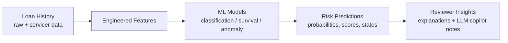
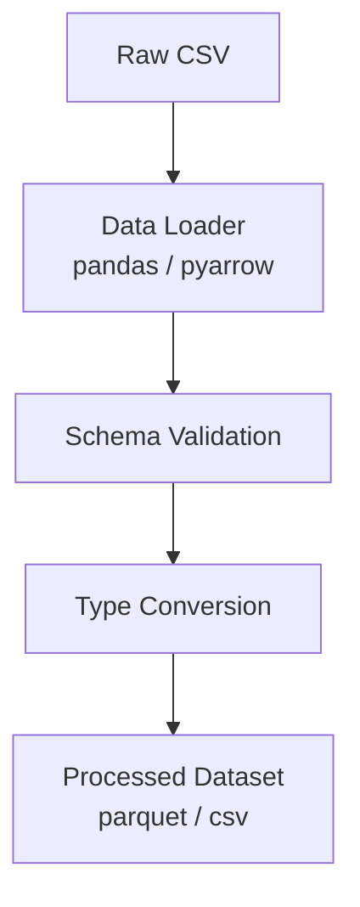
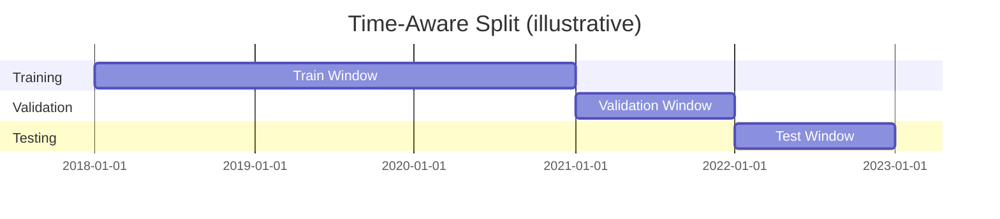
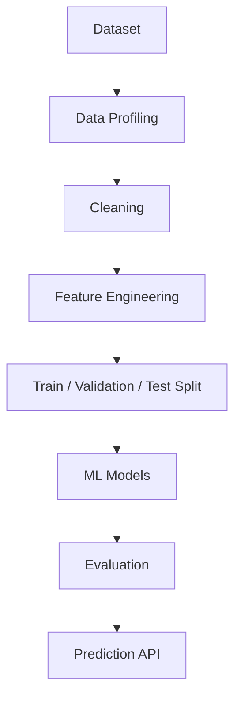
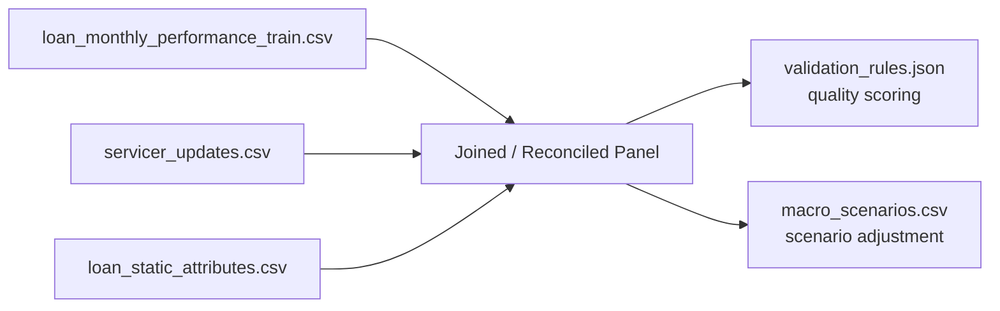
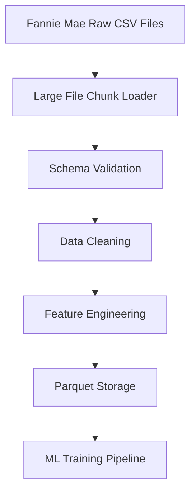
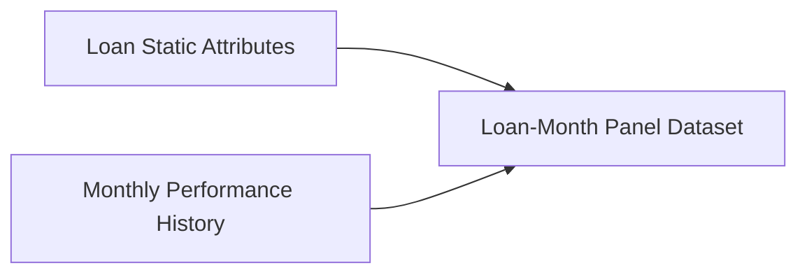
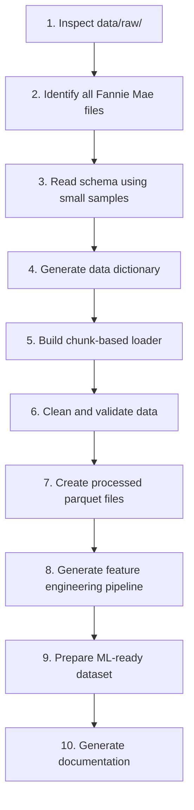

# dataset_usage.md

## Loan Performance Intelligence Engine — Dataset Usage Documentation

**Project:** Loan Performance Intelligence Engine
**Track:** Intain Campus FinTech Challenge 2026 — AI Track
**Document purpose:** Describe how the project's dataset is acquired, structured, cleaned, engineered, and consumed across the full ML lifecycle — from raw ingestion to model training, prediction, anomaly detection, scenario simulation, and explainability.

> **Note on data figures:** This document does not fabricate dataset statistics or model results. Wherever a concrete number would normally appear (row counts, date ranges, feature counts, or metric values), a placeholder is used: `<NUMBER_OF_RECORDS>`, `<DATE_RANGE>`, `<FEATURE_COUNT>`, `<METRIC_VALUE>`. These should be filled in once the actual data pack and trained models are available.

---

## Table of Contents

1. [Dataset Overview](#1-dataset-overview)
2. [Dataset Architecture](#2-dataset-architecture)
3. [Raw Dataset Ingestion](#3-raw-dataset-ingestion)
4. [Dataset Schema Explanation](#4-dataset-schema-explanation)
5. [Data Preprocessing Pipeline](#5-data-preprocessing-pipeline)
6. [Feature Engineering Using Dataset](#6-feature-engineering-using-dataset)
7. [Creating Machine Learning Targets](#7-creating-machine-learning-targets)
8. [Train / Validation / Test Split Strategy](#8-train--validation--test-split-strategy)
9. [Dataset Usage in the ML Pipeline](#9-dataset-usage-in-the-ml-pipeline)
10. [Dataset Usage for Different Models](#10-dataset-usage-for-different-models)
11. [Dataset Usage for Anomaly Detection](#11-dataset-usage-for-anomaly-detection)
12. [Dataset Usage for Scenario Simulation](#12-dataset-usage-for-scenario-simulation)
13. [Supporting Synthetic Datasets](#13-supporting-synthetic-datasets)
14. [Dataset Storage Design](#14-dataset-storage-design)
15. [Dataset Limitations](#15-dataset-limitations)
16. [Reproducibility Guidelines](#16-reproducibility-guidelines)
17. [Claude Code Dataset Processing Instructions](#17-claude-code-dataset-processing-instructions)

---

## 1. Dataset Overview

### 1.1 Primary Dataset

**Dataset:** Fannie Mae Single-Family Loan Performance Dataset (organizer-curated subset, delivered as `loan_monthly_performance_train.csv`, `loan_monthly_performance_test.csv`, and `loan_static_attributes.csv`).

### 1.2 Why This Dataset Was Selected

The Fannie Mae Single-Family Loan Performance Dataset was selected because it is one of the few publicly documented, loan-level, longitudinal mortgage performance datasets that combines:

- **Origination-level attributes** (credit score band, loan-to-value band, debt-to-income band, loan purpose, occupancy type, property type) that describe the loan at the moment it was made.
- **Monthly performance history** (delinquency status, days past due, current balance, prepayment and default flags) that describes how the loan actually behaved over time.

This combination is exactly what is required to move from a static risk snapshot to a **dynamic, time-aware performance model** — which is the core ask of the challenge.

### 1.3 How It Matches the Problem Statement

The problem statement requires the system to profile messy loan-level data, predict multiple performance outcomes (delinquency, default, prepayment, next state), run time-to-event / survival modeling, detect anomalies, simulate scenarios, and explain outputs. The Fannie Mae dataset structure maps directly onto these requirements:

| Requirement | Dataset Property That Satisfies It |
|---|---|
| Data profiling on "messy" data | Real-world servicing data contains missingness, reporting lags, and inconsistent updates |
| Multi-outcome prediction | Monthly status fields allow derivation of delinquency, default, and prepayment labels |
| Time-aware validation | Data is naturally panel-structured (loan × month), enabling chronological splits |
| Survival / transition modeling | Loan status is observed at every month, enabling time-to-event and state-transition modeling |
| Anomaly detection | Loan-month records can be cross-checked against static attributes and servicer updates for inconsistency |
| Scenario simulation | Macro-sensitive fields (delinquency, default, prepayment rates) can be stressed under different economic assumptions |

### 1.4 Why Loan-Level Historical Performance Data Is Required

Portfolio-level or aggregated statistics cannot answer the challenge's core question — *which individual loans are unreliable or likely to deteriorate*. Only loan-level, monthly-granularity history allows the system to:

- Track a single loan's trajectory across many reporting periods.
- Construct forward-looking labels (e.g., "will this loan be 90+ days delinquent in the next 3 months?").
- Detect anomalies that only appear when comparing a loan's current record against its own history.
- Perform survival analysis, where the "clock" for each loan must be tracked from origination or from a defined observation start point.

### 1.5 What the Dataset Supports

The dataset, once processed, supports the following modeling capabilities:

- **Delinquency prediction** — probability a loan becomes delinquent in a future window.
- **Default prediction** — probability a loan defaults within a future window.
- **Prepayment prediction** — probability a loan is paid off early.
- **Survival analysis** — time-to-event modeling for default, prepayment, or closure.
- **Loan state transition modeling** — probability of moving between states (Current, Delinquent, Default, Prepaid, Closed).
- **Anomaly detection** — identification of loan-month records that are internally inconsistent or inconsistent with servicer updates.

### 1.6 Data-to-Insight Relationship



The pipeline is strictly one-directional in terms of authority: **machine learning models produce the predictions**; the LLM copilot only summarizes, explains, and contextualizes what the ML layer has already produced. The LLM never generates the underlying risk prediction itself.

---

## 2. Dataset Architecture

The project organizes data into four logical layers — raw, processed, supporting, and (implicitly) model-ready — each with a distinct role in the pipeline.

```
data/
├── raw/
│   ├── fannie_acquisition_data.csv
│   └── fannie_monthly_performance_data.csv
├── processed/
│   ├── loan_monthly_performance_train.csv
│   ├── loan_static_attributes.csv
│   ├── engineered_features.csv
├── supporting/
│   ├── servicer_updates.csv
│   ├── validation_rules.json
│   └── macro_scenarios.csv
```

### 2.1 Purpose of Each File

| File | Layer | Purpose |
|---|---|---|
| `fannie_acquisition_data.csv` | raw | Origination-time snapshot of each loan exactly as delivered by the source; never modified after download. |
| `fannie_monthly_performance_data.csv` | raw | Full monthly servicing history exactly as delivered; the source of all time-series labels and features. |
| `loan_monthly_performance_train.csv` | processed | Cleaned, validated, loan-month panel used directly for feature engineering and model training. |
| `loan_static_attributes.csv` | processed | One row per loan describing origination-level attributes (credit score band, LTV band, DTI band, etc.), joined onto the monthly panel by `loan_id`. |
| `engineered_features.csv` | processed | Final model-ready feature table produced by the feature engineering pipeline (Section 6), including targets. |
| `servicer_updates.csv` | supporting | Secondary, partially overlapping source used to detect conflicting or stale records. |
| `validation_rules.json` | supporting | Machine-readable deterministic rules (e.g., balance consistency, valid date ranges) used for automated data-quality scoring. |
| `macro_scenarios.csv` | supporting | Scenario assumptions (base, adverse-credit, high-prepayment) used to drive portfolio stress simulation. |

Keeping `raw/` strictly immutable and separating `processed/` from `supporting/` ensures the pipeline is auditable: any transformation can be traced back to an unmodified source file, and every derived artifact can be regenerated deterministically.

---

## 3. Raw Dataset Ingestion

### 3.1 Download Process

- **Downloading Fannie Mae quarterly files:** The organizer-provided data pack substitutes for direct portal registration during the hackathon, but in a production-grade version of this system, quarterly acquisition and performance files would be pulled from the Fannie Mae Single-Family Loan Performance Data / Data Dynamics portal on a scheduled basis.
- **Organizing raw data:** Each quarterly drop is stored under a dated subfolder (e.g., `raw/<DATE_RANGE>/`) so that no two ingestion runs overwrite one another.
- **Maintaining original data:** Raw files are treated as read-only, immutable artifacts. All cleaning, joining, and feature work happens on copies in `processed/`, never on the raw files themselves.
- **Data versioning:** Each raw drop is tagged with an ingestion timestamp and a source checksum so that any processed dataset can be traced back to the exact raw snapshot that produced it.

### 3.2 Data Loading

**Libraries used:**

- `pandas` — primary in-memory tabular manipulation.
- `pyarrow` — efficient, typed columnar I/O and interoperability with Parquet.
- `parquet` (via `pyarrow`) — storage format for processed and feature tables, chosen over CSV for downstream stages because it preserves data types and compresses efficiently at scale.

**Loading steps:**

1. **CSV ingestion** — raw quarterly files are read in chunks (using `pandas.read_csv` with explicit `dtype` hints) to avoid type-inference errors on large files and to control memory usage.
2. **Schema validation** — column names, expected types, and required fields are checked against a defined schema contract before the file is accepted into `processed/`.
3. **Data type conversion** — date-like strings are parsed into proper datetime types, categorical bands are cast to `category` dtype, and numeric fields are cast to appropriately sized numeric types.



Files that fail schema validation are quarantined (not silently dropped) so that ingestion failures are visible and auditable rather than causing silent data loss.

---

## 4. Dataset Schema Explanation

The schema below reflects the fields listed in the problem statement's "Example Training Fields and Targets" section, grouped by function.

### 4.1 Loan Identification

| Column | Type | Purpose |
|---|---|---|
| `loan_id` | string | Unique identifier for a loan; the primary key linking the static attributes table, the monthly performance panel, and servicer updates. |
| `month_index` | integer | Sequential index of the observation month for a given loan, used to order the panel and compute rolling/lagged features. |

These two columns together form the panel index (`loan_id`, `month_index`), allowing every loan to be tracked consistently across its full servicing history.

### 4.2 Financial Features

| Column | Type | Purpose |
|---|---|---|
| `original_balance` | numeric | The loan amount at origination; the baseline against which amortization and risk are measured. |
| `current_balance` | numeric | Outstanding principal balance as of the reporting month; a direct indicator of amortization progress or payment stress. |
| `interest_rate` | numeric | The loan's interest rate; influences payment burden and, indirectly, default and prepayment incentives. |

**How they influence risk:** A current balance that shrinks slower than expected relative to the amortization schedule can signal missed payments or capitalized arrears. Higher interest rates increase monthly payment burden, which is empirically associated with elevated delinquency and default risk, while also creating a stronger financial incentive to refinance (prepayment risk) when market rates fall below the loan's rate.

### 4.3 Borrower / Credit Features

| Column | Type | Purpose |
|---|---|---|
| `credit_score_band` | categorical | Bucketed borrower creditworthiness at origination. |
| `ltv_band` | categorical | Bucketed loan-to-value ratio, reflecting borrower equity in the property. |
| `dti_band` | categorical | Bucketed debt-to-income ratio, reflecting borrower payment capacity relative to income. |

**Risk importance:** These three bands are among the strongest, most literature-supported predictors of mortgage performance. Lower credit score bands are associated with higher default probability; higher LTV bands indicate less borrower equity cushion (higher loss severity and higher walk-away incentive); higher DTI bands indicate a borrower with less income slack to absorb payment shocks.

### 4.4 Time Features

| Column | Type | Purpose |
|---|---|---|
| `origination_month` | date | The month the loan was originated. |
| `reporting_month` | date | The month the performance record refers to. |
| `loan_age_months` | integer | Number of months since origination, i.e., `reporting_month − origination_month`. |
| `remaining_term_months` | integer | Months remaining until scheduled maturity. |

**Importance for time-aware validation:** These fields are what make a strictly chronological train/validation/test split possible (Section 8) — without them, it would be impossible to guarantee that no future information leaks into training data.

**Importance for survival analysis:** `loan_age_months` provides the natural "clock" (duration variable) for time-to-event modeling, while `remaining_term_months` helps define the censoring horizon for loans that have not yet experienced the event of interest (default, prepayment, or closure) by the end of the observation window.

### 4.5 Performance Features

| Column | Type | Purpose |
|---|---|---|
| `current_status` | categorical | The loan's servicing status as of the reporting month (e.g., Current, Delinquent, Default, Prepaid, Closed). |
| `days_past_due` | integer | Number of days the borrower is behind on payment. |
| `default_flag` | binary | Indicator that the loan is in a defined default state as of this record. |
| `prepayment_flag` | binary | Indicator that the loan was paid off early as of this record. |

**How they become ML targets:** These are the raw, present-tense observations from which *forward-looking* targets are derived (Section 7). For example, `current_status` and `days_past_due` observed in future months are used to construct `next_3m_delinquency_flag`, while `default_flag` and `prepayment_flag` observed in future months are used to construct `next_12m_default_flag` and `next_12m_prepayment_flag` respectively, always computed by looking forward from a given `reporting_month`, never backward.

---

## 5. Data Preprocessing Pipeline

### 5.1 Missing Value Handling

- **Detection:** Column-level missingness rates are computed per file and per reporting period, surfaced in the data profiling report (a required deliverable per the problem statement).
- **Analysis:** Missingness is categorized as structural (e.g., `days_past_due` is naturally absent for a loan not yet delinquent), reporting-lag related (e.g., a servicer has not yet submitted the month's update), or genuinely missing/erroneous.
- **Imputation strategies:**
  - Structural missingness is encoded explicitly (e.g., `days_past_due = 0` when `current_status = Current`) rather than imputed statistically.
  - Reporting-lag missingness is forward-filled from the loan's own prior month where appropriate, with a flag column marking the value as carried forward.
  - Genuinely missing categorical fields are assigned an explicit `"Unknown"` category rather than a mode-imputed value, to avoid injecting false signal.
  - Numeric fields with missingness are imputed using median-by-segment (e.g., median `current_balance` within the same `credit_score_band` and `loan_age_months` bucket) only when the missingness is confirmed non-informative.

### 5.2 Duplicate Handling

Duplicate loan-month records are detected by grouping on the composite key (`loan_id`, `reporting_month`) and flagging any group with more than one row. When duplicates are found:

- If the rows are byte-identical, the extras are dropped.
- If the rows differ (e.g., conflicting `current_status` values from two source drops), the record is routed to the anomaly/exception pipeline (Section 11) rather than being silently resolved, since silent resolution could mask a genuine data-quality issue that a reviewer should see.

### 5.3 Data Type Conversion

- **Dates:** All date-like fields (`origination_month`, `reporting_month`, `last_updated_at`) are parsed into timezone-naive `datetime64` types and validated to fall within a plausible range.
- **Numerical columns:** Balances and rates are cast to appropriately sized floats; count-like fields (`days_past_due`, `loan_age_months`) are cast to integers.
- **Categorical columns:** Band and status fields (`credit_score_band`, `ltv_band`, `dti_band`, `current_status`) are cast to pandas `category` dtype with an explicit, validated category list, so that unexpected category values are caught rather than silently accepted.

### 5.4 Invalid Record Detection

The pipeline applies deterministic checks (also encoded in `validation_rules.json`, Section 13) to flag structurally invalid records, including:

- `current_balance > original_balance` (impossible under standard amortization without a documented modification).
- Invalid or inconsistent dates, e.g., `reporting_month < origination_month`, or `reporting_month` in the future relative to the file's known cutoff.
- Incorrect delinquency status, e.g., `days_past_due = 0` while `current_status = Delinquent`, or a large `days_past_due` value while `current_status = Current`.

Records failing these checks are not deleted; they are tagged with an exception type and surfaced to the anomaly/exception detection layer (Section 11), preserving them for reviewer inspection.

---

## 6. Feature Engineering Using Dataset

Raw fields are transformed into model-ready features across four categories.

### 6.1 Financial Features

| Feature | Formula (illustrative) |
|---|---|
| Balance reduction ratio | `(original_balance − current_balance) / original_balance` |
| Loan utilization | `current_balance / original_balance` |
| Remaining loan percentage | `current_balance / original_balance × 100` |

These features normalize balance information across loans of very different original sizes, making them comparable inputs to a model.

### 6.2 Temporal Features

| Feature | Description |
|---|---|
| Previous delinquency history | Count or binary flag of any delinquent status observed in the loan's prior N months. |
| Rolling payment behavior | Rolling mean/max of `days_past_due` over a trailing window (e.g., 3, 6, 12 months). |
| Number of missed payments | Cumulative count of months where `days_past_due` exceeded a defined threshold. |

These features let the model see *trajectory*, not just a single-month snapshot — a loan that has been slowly deteriorating over six months is a different risk profile from one that is stable and suddenly delinquent.

### 6.3 Risk Features

| Feature | Description |
|---|---|
| Credit risk score | A derived composite score combining `credit_score_band`, `ltv_band`, and payment history into a single ordinal or numeric risk indicator. |
| Debt burden | A derived measure combining `dti_band` and `interest_rate` to approximate monthly payment stress. |
| Loan age risk | A feature capturing known non-linear risk patterns over the loan lifecycle (e.g., elevated default risk in early years, elevated prepayment risk mid-life as rates change). |

### 6.4 Interaction Features

| Feature | Rationale |
|---|---|
| Credit score × LTV | Captures compounding risk — a low-credit, high-LTV loan is materially riskier than either factor alone would suggest. |
| DTI × interest rate | Captures compounding payment stress — high DTI combined with a high rate indicates a borrower with very little payment slack. |

Interaction features are particularly important for tree-based models (Section 10), which can exploit them directly, and are also useful diagnostic inputs for the explainability layer (SHAP interaction values).

---

## 7. Creating Machine Learning Targets

All targets are constructed by looking **forward** from a given `(loan_id, reporting_month)` observation into that loan's own future records — never by looking backward or across loans — to prevent leakage.

### 7.1 Delinquency Prediction

**Targets:** `next_3m_delinquency_flag`, `next_6m_delinquency_flag`

These are binary labels indicating whether the loan reaches a defined delinquency threshold (e.g., 30+ or 60+ days past due) at any point within the next 3 or 6 months following the observation month. They are generated by scanning each loan's future monthly records within the relevant window and applying the delinquency threshold rule, then flagging the current row accordingly.

### 7.2 Default Prediction

**Target:** `next_12m_default_flag`

**Prediction objective:** Estimate the probability that a loan, which is not currently in default, transitions into a default state within the next 12 months. This is generated analogously to the delinquency targets, scanning forward up to 12 months and checking whether `default_flag` becomes 1 at any point in that window.

### 7.3 Prepayment Prediction

**Target:** `next_12m_prepayment_flag`

This label indicates whether the loan is fully prepaid within the next 12 months. It is constructed the same way as the default target, but scanning for `prepayment_flag = 1` (or `current_status = Prepaid`) in the forward window. Prepayment and default are modeled as distinct, non-mutually-reinforcing outcomes since they represent economically opposite borrower behaviors (early payoff vs. non-payment).

### 7.4 Next State Prediction

**States:** `Current`, `Delinquent`, `Default`, `Prepaid`, `Closed`

Rather than a single binary flag, `next_state` is a multi-class target representing which of the five defined states the loan occupies at the *next* reporting month. This supports a Markov-style transition modeling approach: at each month, the model estimates a probability distribution over the possible next states given the loan's current state and features, which can be aggregated into a full state-transition matrix at the portfolio level.

---

## 8. Train / Validation / Test Split Strategy

### 8.1 Why Random Splitting Is Wrong

A naive random row-level split — where individual `(loan_id, reporting_month)` rows are randomly assigned to train, validation, or test — is invalid for this dataset for two compounding reasons:

1. **Same-loan leakage:** Multiple monthly rows from the same loan are highly correlated. If some months from a loan land in training and other months from the *same* loan land in validation, the model can effectively "memorize" that loan's trajectory rather than learning generalizable patterns — inflating validation performance in a way that will not hold on genuinely unseen loans.
2. **Temporal leakage:** Because targets are forward-looking (Section 7), a randomly selected training row from `2021-03` may have its target computed using information from `2021-04`–`2022-03`. If evaluation rows from earlier calendar time are excluded but training accidentally includes rows temporally *after* the validation window, the model is effectively trained on the future to predict the past.

### 8.2 Time-Aware Split

The correct approach splits by **calendar time**, so that the model is always trained on the past and evaluated on data that is chronologically later.

**Illustrative split (exact boundaries depend on the delivered data's `<DATE_RANGE>`):**



| Split | Period (illustrative) |
|---|---|
| Training | 2018–2020 |
| Validation | 2021 |
| Testing | 2022 |

### 8.3 Preventing Data Leakage and Future Information Usage

- **Loan-level containment:** In addition to the time cutoff, all rows belonging to a given `loan_id` are assigned to a single split based on the loan's origination or earliest-observed period, preventing a loan from straddling train and validation.
- **Forward-label horizon respected at the boundary:** Rows near the end of the training window whose forward-looking target window would extend past the training cutoff are either excluded or clearly documented as having a truncated label horizon, so the model is never trained on partially-known future outcomes.
- **No test-time features derived from post-cutoff information:** All rolling/lagged features (Section 6.2) are computed strictly using data available as of the observation month, never including any information from later months.

---

## 9. Dataset Usage in the ML Pipeline



| Step | Description |
|---|---|
| **Dataset** | Raw and joined loan-level, loan-month panel data (Sections 2–4). |
| **Data Profiling** | Distribution analysis, missingness patterns, outlier detection, correlation analysis, and train/test drift comparison, producing the Data Intelligence Report required by the challenge. |
| **Cleaning** | Missing value handling, duplicate resolution, type conversion, and invalid record flagging (Section 5). |
| **Feature Engineering** | Construction of financial, temporal, risk, and interaction features plus forward-looking targets (Sections 6–7). |
| **Train / Validation / Test Split** | Strict time-aware, loan-contained split (Section 8). |
| **ML Models** | Supervised classifiers, survival/transition models, and anomaly detectors trained on the engineered feature table (Section 10). |
| **Evaluation** | Metric computation (ROC-AUC, PR-AUC, F1, recall at fixed precision, Brier score, macro-F1) on the held-out validation/test splits, with baseline-vs-improved model comparison. |
| **Prediction API** | Serving layer that accepts new loan-month records, applies the same feature pipeline, and returns probabilities, anomaly scores, and next-state predictions consumed by the reviewer copilot and submission file generator. |

---

## 10. Dataset Usage for Different Models

| Model | Dataset Usage |
|---|---|
| XGBoost | Default prediction — gradient-boosted trees on the full engineered feature table, well suited to the tabular, mixed categorical/numeric, interaction-heavy nature of the data. |
| LightGBM | Risk classification (delinquency / general multi-outcome risk) — chosen for efficient training on the large loan-month panel and native handling of categorical bands. |
| Random Forest | Baseline model — a simpler, less tuning-sensitive ensemble used as the baseline against which XGBoost/LightGBM improvements are measured, per the challenge's baseline-vs-improved requirement. |
| Survival Model | Time-to-event prediction — consumes `loan_age_months` as the duration variable and `default_flag`/`prepayment_flag`/`current_status` transitions as event indicators, with right-censoring for loans that have not yet experienced the event by the end of the observation window. |
| Isolation Forest | Anomaly detection — trained on the engineered numeric feature space (balances, ratios, rolling behavior) to score each loan-month record's structural unusualness without requiring labeled anomalies. |
| SHAP | Explanation — applied post-hoc to the trained XGBoost/LightGBM models to produce global feature importance and per-loan local explanations for the explainability layer (Section 11 of the problem statement's task list). |

Each model consumes the **same underlying `engineered_features.csv` table**, differing only in which columns are used as features vs. targets and how the panel structure is framed (row-level classification vs. duration/event framing for the survival model vs. unsupervised scoring for Isolation Forest).

---

## 11. Dataset Usage for Anomaly Detection

### 11.1 How Anomalies Are Detected

Anomalies are detected using a combination of deterministic and statistical/ML approaches, applied to the same processed loan-month panel:

- **Balance inconsistency** — e.g., `current_balance` increasing without a documented modification, or `current_balance > original_balance`.
- **Invalid dates** — e.g., `reporting_month` earlier than `origination_month`, or gaps/duplicates in the monthly sequence for a given loan.
- **Conflicting servicer updates** — e.g., `servicer_updates.csv` reporting a different `current_status` or `days_past_due` than the primary monthly performance file for the same `loan_id` and period.
- **Unusual payment behavior** — e.g., a sudden large drop in `days_past_due` without a corresponding balance change consistent with a full catch-up payment, or erratic status flapping between Current and Delinquent across consecutive months.

### 11.2 Detection Layers

- **Rule-based checks:** The deterministic checks defined in `validation_rules.json` (Section 5.4, Section 13) catch structurally impossible or clearly invalid records and assign an explicit `exception_type`.
- **Isolation Forest:** Trained on the numeric engineered feature space to assign a continuous anomaly score to every loan-month record, capturing statistically unusual combinations of features that rule-based checks would not explicitly enumerate.
- **Autoencoders:** An optional, more expressive unsupervised approach that learns to reconstruct "normal" loan-month feature vectors; records with high reconstruction error are flagged as anomalous. This complements Isolation Forest, particularly for capturing non-linear, multi-feature anomaly patterns.

The combination of rule-based and ML-based detection ensures both **explainable, deterministic** exceptions (for regulatory/audit clarity) and **statistically-driven** exceptions (for catching subtler, unanticipated data-quality issues) — directly supporting the challenge's requirement for at least 20 reviewer-ready anomaly examples with explained drivers.

---

## 12. Dataset Usage for Scenario Simulation

Scenario simulation reuses the same trained performance models (Section 10) but re-scores the loan population under adjusted macroeconomic and behavioral assumptions sourced from `macro_scenarios.csv` (Section 13).

### 12.1 Base Scenario

Represents normal, currently-observed economic conditions. Model predictions are generated using the feature distributions as observed in the most recent processed data, with no macro adjustment applied. This serves as the reference point against which stressed scenarios are compared.

### 12.2 Adverse Credit Scenario

Applies stressed macro assumptions from `macro_scenarios.csv` that increase:

- **Higher delinquency** — shifting relevant features (e.g., assumed rolling payment behavior, debt burden) to reflect a deteriorating macro-credit environment.
- **Higher default probability** — reflected either as a direct adjustment to model input features or as a post-hoc calibration shift applied to output probabilities, depending on the modeling approach chosen.

### 12.3 High Prepayment Scenario

Applies assumptions reflecting a rate environment that incentivizes refinancing:

- **Faster loan closure** — increased prepayment probability across the portfolio, particularly concentrated in segments with rate/LTV/credit profiles that make refinancing economically attractive.

### 12.4 Portfolio-Level Analysis

Under each scenario, individual loan-level predictions are aggregated to produce:

- Projected delinquency, default, and prepayment **rates** at the overall portfolio level.
- **Segment-level breakdowns** by vintage, credit band, state, or servicer, so that reviewers can see which segments drive the portfolio-level movement.
- A comparison table across Base / Adverse-Credit / High-Prepayment scenarios, annotated with the top features driving the projected shift (feeding directly into the explainability layer).

---

## 13. Supporting Synthetic Datasets

### 13.1 `servicer_updates.csv`

**Purpose:**

- **Source conflict detection** — provides a second, partially overlapping view of loan status/balance that can disagree with the primary monthly performance file, simulating the real-world situation where multiple servicing systems report on the same loan.
- **Data reconciliation** — used to build and test logic for resolving conflicting records (e.g., preferring the most recently timestamped update, or flagging irreconcilable conflicts for manual review).

### 13.2 `validation_rules.json`

**Purpose:**

- **Automated data quality checks** — a machine-readable set of deterministic rules (balance consistency, date validity, delinquency-status consistency, closed/prepaid status logic, document gaps) that are applied uniformly across ingestion, cleaning, and anomaly detection, ensuring rule logic is defined once and reused everywhere rather than duplicated in code.

### 13.3 `macro_scenarios.csv`

**Purpose:**

- **Stress testing** — supplies the quantitative assumptions (e.g., delinquency/default/prepayment multipliers or shift parameters) that parameterize the Base, Adverse-Credit, and High-Prepayment scenarios described in Section 12.

### 13.4 Integration with the Main Dataset

All three supporting files join back onto the core loan-month panel via `loan_id` (and, where applicable, `reporting_month`):



This keeps the supporting datasets modular — each can be updated or extended independently (e.g., new validation rules added, new scenarios defined) without requiring changes to the core ingestion or feature engineering code.

---

## 14. Dataset Storage Design

| Layer | Contents | Format | Notes |
|---|---|---|---|
| Raw storage | Unmodified source files (`raw/`) | CSV | Immutable; versioned by ingestion timestamp and checksum. |
| Processed storage | Cleaned, validated, joined panel (`processed/`) | CSV / Parquet | Regenerable from raw storage via the ingestion + cleaning pipeline; Parquet preferred for larger tables due to type preservation and compression. |
| Feature storage | `engineered_features.csv` (or Parquet equivalent) | Parquet | Model-ready table including all engineered features and targets; regenerable from processed storage via the feature engineering pipeline. |
| Model input storage | Split-specific feature slices (train/validation/test) consumed directly by training and evaluation code | Parquet | Generated by applying the Section 8 split logic to feature storage; not persisted as a separate permanent copy beyond the experiment's artifact store, to avoid drift from the canonical feature table. |

**Folder structure (repeated for reference, extended with a features layer):**

```
data/
├── raw/
│   ├── fannie_acquisition_data.csv
│   └── fannie_monthly_performance_data.csv
├── processed/
│   ├── loan_monthly_performance_train.csv
│   ├── loan_static_attributes.csv
│   └── engineered_features.csv
├── supporting/
│   ├── servicer_updates.csv
│   ├── validation_rules.json
│   └── macro_scenarios.csv
└── splits/
    ├── train.parquet
    ├── validation.parquet
    └── test.parquet
```

---

## 15. Dataset Limitations

- **Synthetic preprocessing differences:** The organizer-provided data pack is described as curated synthetic or preprocessed data inspired by public sources; it may not perfectly reflect the noise, scale, or edge cases present in true production mortgage-servicing data, so conclusions drawn from it should be validated against real data before production use.
- **Missing borrower information:** The dataset uses bucketed bands (credit score, LTV, DTI) rather than granular borrower-level information, which limits the model's ability to capture fine-grained borrower risk and is a deliberate privacy-preserving simplification rather than a data-quality defect.
- **Bias risks:** Historical loan performance data reflects historical lending, servicing, and macroeconomic conditions, which may embed patterns correlated with protected characteristics (e.g., via geography or credit history) even when such characteristics are not directly present as features. Any deployed model should undergo explicit bias/fairness analysis (an "Advanced Feature" in the problem statement) before being used to inform real decisions.
- **Historical market dependency:** Relationships learned from a specific historical period (a specific `<DATE_RANGE>`) reflect the interest-rate and macroeconomic environment of that period. A model trained on one regime may not generalize well to a materially different rate or credit environment, which is precisely why scenario simulation (Section 12) is included as a first-class capability rather than an afterthought.

---

## 16. Reproducibility Guidelines

- **Dataset versioning:** Every raw file, processed file, and feature table is tagged with a version identifier (ingestion timestamp + source checksum) so any downstream artifact can be traced back to its exact input data.
- **Data snapshots:** Immutable snapshots of `processed/` and `data/splits/` are retained per experiment run, so that a model's reported metrics can always be reproduced against the exact data it was trained and evaluated on.
- **Configuration files:** All pipeline parameters (imputation thresholds, delinquency-day cutoffs, forward-label windows, split date boundaries, scenario assumptions) are stored in versioned configuration files rather than hard-coded, so a run can be fully reconstructed from `(code version, config version, data version)`.
- **Random seeds:** All stochastic steps (model initialization, any sampling used for class-imbalance handling, cross-validation folds within a split) use fixed, logged random seeds.
- **Experiment tracking:** Each training run logs its data version, config, seed, resulting metrics (`<METRIC_VALUE>` placeholders to be filled from actual runs), and model artifact identifier to an experiment tracking system (e.g., MLflow or Weights & Biases, per the challenge's advanced-feature suggestions), enabling direct comparison across baseline and improved models.

---

## 17. Claude Code Dataset Processing Instructions

### 17.1 Purpose

This section defines how **Claude Code** should access, analyze, and process the large Fannie Mae Single-Family Loan Performance dataset used in the Loan Performance Intelligence Engine. It exists to turn this document from a pure ML design reference into a working **agent instruction set**: where the files live, why they must never be opened naively, how they should be chunked and validated, which scripts must exist, and which outputs those scripts must produce.

Claude Code should treat this as a large-scale ML data engineering task, not an interactive data-exploration task. The raw dataset files may be several GB each and must be processed using efficient, memory-safe techniques.

### 17.2 Expected Project Structure

```
Loan-Performance-Engine/
├── data/
│   ├── raw/
│   │   ├── 2018Q1.csv
│   │   ├── 2018Q2.csv
│   │   ├── 2018Q3.csv
│   │   ├── ...
│   │   └── 2021Q4.csv
│   ├── extracted/
│   ├── processed/
│   │   ├── loan_static_attributes.parquet
│   │   ├── loan_monthly_performance.parquet
│   │   └── engineered_features.parquet
├── src/
│   └── data/
│       ├── data_loader.py
│       ├── schema_validator.py
│       ├── preprocessing.py
│       ├── feature_engineering.py
│       └── dataset_builder.py
├── docs/
│   ├── data_dictionary.md
│   └── data_quality_report.md
```

This extends the storage design in Section 14 with the concrete `src/data/` scripts and `docs/` reports that Claude Code is responsible for generating and maintaining.

### 17.3 Ground Rules for Claude Code

#### Rule 1 — Never Open Raw Files Manually

The Fannie Mae CSV files are extremely large (a single quarterly file, e.g. `2018Q1.csv`, may be **~6GB+**).

**Do NOT:**

- Open files using Excel or any GUI spreadsheet tool.
- Load a complete CSV file into memory in one call.
- Convert or edit raw files manually.
- Modify raw files directly — `data/raw/` remains immutable, consistent with Section 3.1.

**Incorrect (do not do this):**

```python
import pandas as pd

df = pd.read_csv("2018Q1.csv")  # risks memory failure on multi-GB files
```

#### Rule 2 — Use Chunk-Based Processing

All large CSV files must be read and processed in chunks, never in a single pass.

```python
import pandas as pd

for chunk in pd.read_csv(file_path, chunksize=100000):
    process(chunk)
```

For each raw file, the pipeline should, per chunk:

1. Read the chunk.
2. Validate its schema.
3. Clean the data.
4. Transform/engineer features.
5. Append the processed chunk to output storage.
6. Continue to the next chunk.

#### Rule 3 — Dataset Discovery Workflow

Before performing any transformation, Claude Code should:

1. Scan all files inside `data/raw/`.
2. Identify, per file:
   - File name and size
   - Number of columns
   - Column names and inferred data types
   - Missing-value presence
3. Classify columns into:
   - Acquisition (origination-level) fields
   - Performance (monthly observation) fields
   - Loan identifier columns
   - Monthly observation/time fields
4. Generate `docs/data_dictionary.md`, containing at minimum:

| Column | Type | Meaning | Usage |
|---|---|---|---|
| `loan_id` | string | Unique loan identifier | Primary key |
| `reporting_month` | date | Monthly observation period | Time series |
| `current_balance` | numeric | Remaining balance | Risk feature |
| `default_flag` | binary | Default indicator | Prediction target |

(This table is illustrative — the generated `data_dictionary.md` should enumerate every column actually discovered in the raw files, not just this sample set.)

#### Rule 4 — Raw Data Processing Pipeline

Claude Code should implement the following pipeline end to end:



This mirrors the ingestion flow in Section 3.2 and the pipeline in Section 9, but adds the explicit chunk-loading requirement needed for multi-GB source files.

### 17.4 Required Processing Scripts

Claude Code must create the following scripts under `src/data/`:

```
src/data/
├── data_loader.py
├── schema_validator.py
├── preprocessing.py
├── feature_engineering.py
└── dataset_builder.py
```

| Script | Responsibilities |
|---|---|
| `data_loader.py` | Read large CSV files; support chunked reads; handle multiple quarterly files; track ingestion logs; preserve raw data unmodified. |
| `schema_validator.py` | Validate required columns, data types, missing values, and invalid formats against the schema contract; generate validation reports. |
| `preprocessing.py` | Perform missing value handling, duplicate detection, date conversion, general data cleaning, and category encoding (per Section 5). |
| `feature_engineering.py` | Create financial, temporal, risk, and interaction features (per Section 6). |
| `dataset_builder.py` | Assemble and write the final ML-ready datasets: `loan_static_attributes.parquet`, `loan_monthly_performance.parquet`, `engineered_features.parquet`. |

### 17.5 Required Output Datasets

#### `loan_static_attributes.parquet`

One row per loan. Contains: `loan_id`, `credit_score_band`, `ltv_band`, `dti_band`, `loan_purpose`, `property_type`, `occupancy_type`, `original_balance`, `origination_month`, `state`.

**Purpose:** Used for borrower and origination risk analysis.

#### `loan_monthly_performance.parquet`

One row per loan per month. Contains: `loan_id`, `reporting_month`, `month_index`, `current_balance`, `current_status`, `days_past_due`, `default_flag`, `prepayment_flag`.

**Purpose:** Used for default prediction, delinquency prediction, prepayment prediction, survival modeling, and transition modeling.

#### `engineered_features.parquet`

Contains: `loan_id`, `reporting_month`, `balance_ratio`, `loan_age`, `delinquency_history`, `rolling_payment_features`, `risk_features`, `interaction_features`, `prediction_targets`.

**Purpose:** Direct, model-ready input for ML models (Section 6 features + Section 7 targets, materialized).

### 17.6 Dataset Joining Logic

Acquisition and performance data are joined using `loan_id`:



**Final structure:** one row = one loan at one month.

**Example:**

| loan_id | month | status |
|---|---|---|
| 10001 | Jan-2018 | Current |
| 10001 | Feb-2018 | Current |
| 10001 | Mar-2018 | Delinquent |

### 17.7 Data Quality Validation

Before generating ML-ready datasets, Claude Code should run the following checks (consistent with Sections 5.1–5.4 and 11.1):

- **Missing value analysis** — missing percentage per column, missing patterns over time, and identification of structurally-expected missing values (vs. genuine gaps).
- **Duplicate detection** — duplicate `loan_id` + `reporting_month` combinations.
- **Date validation** — invalid cases such as `reporting_month < origination_month`.
- **Balance validation** — invalid cases such as `current_balance > original_balance`.
- **Delinquency validation** — inconsistent cases such as `days_past_due = 0` while `current_status = Delinquent`.

All findings should be written to `docs/data_quality_report.md`.

### 17.8 Performance Optimization Rules

**Prefer:**

- Pandas chunk processing
- PyArrow
- Parquet storage format
- Vectorized operations

**Avoid:**

- Excel
- Manual CSV editing
- Row-by-row Python loops
- Loading entire datasets into memory at once

### 17.9 Storage Conversion

After cleaning, raw CSV data is converted to Parquet:

```python
df.to_parquet(
    "loan_monthly_performance.parquet",
    compression="snappy"
)
```

**Benefits:** faster loading, smaller storage footprint, preserved data types, and better downstream ML pipeline performance — consistent with the storage rationale in Section 14.

### 17.10 Claude Code Execution Workflow



### 17.11 Claude Code Initial Prompt

Use the following instruction to kick off dataset processing:

> Process the Fannie Mae Single-Family Loan Performance files inside `data/raw`.
>
> Do not open the files manually. The files are several GBs, so use chunk-based processing.
>
> Tasks:
> 1. Inspect all raw files.
> 2. Identify acquisition and performance fields.
> 3. Generate a data dictionary.
> 4. Create schema validation.
> 5. Build preprocessing pipeline.
> 6. Convert raw CSV files into parquet.
> 7. Create: `loan_static_attributes.parquet`, `loan_monthly_performance.parquet`, `engineered_features.parquet`.
> 8. Generate data quality reports.
> 9. Preserve raw files without modification.
> 10. Document every transformation.

### 17.12 Expected Final Result

After Claude Code completes this workflow, the repository should contain:

```
data/
├── raw/
│   └── Original Fannie Mae files (unmodified)
├── processed/
│   ├── loan_static_attributes.parquet
│   ├── loan_monthly_performance.parquet
│   └── engineered_features.parquet

docs/
├── data_dictionary.md
└── data_quality_report.md

src/
└── data_pipeline/
```

At this point the dataset is ready for the downstream tasks described earlier in this document: ML training (Sections 7, 9, 10), default/delinquency/prepayment prediction (Section 7), survival modeling (Sections 4.4, 10), anomaly detection (Section 11), scenario simulation (Section 12), explainability (Section 10), and LLM reviewer integration (Section 1.6).

---

*End of dataset_usage.md*
