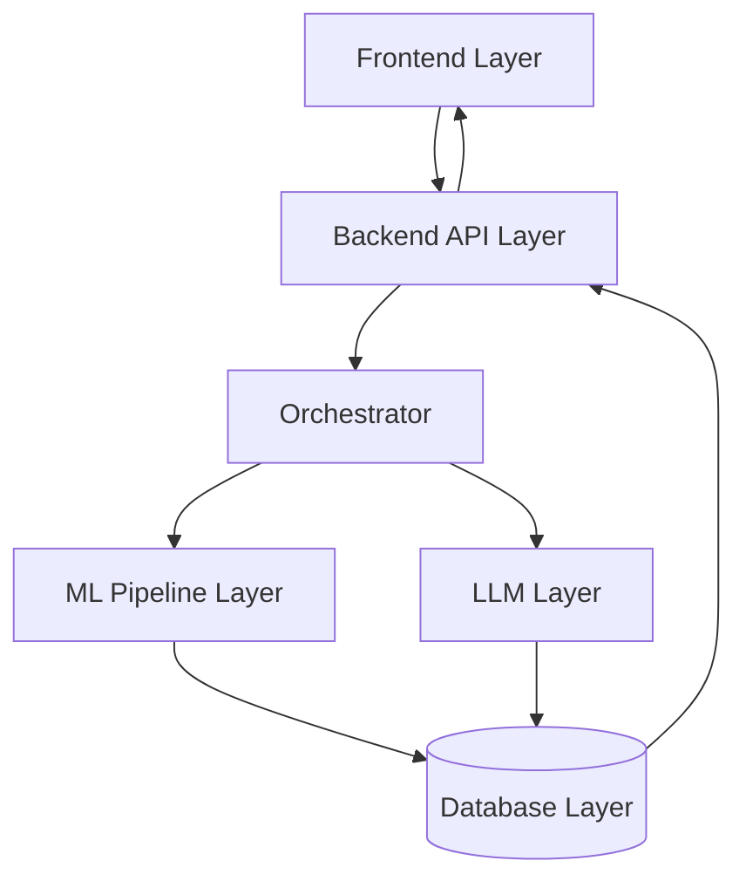
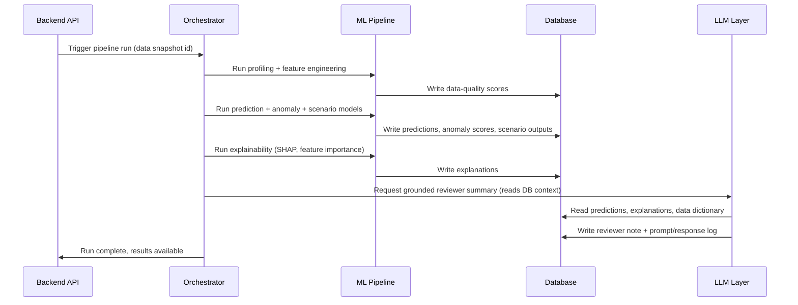
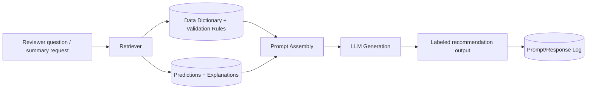
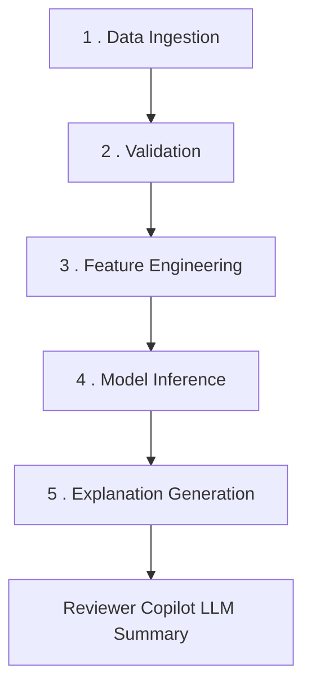
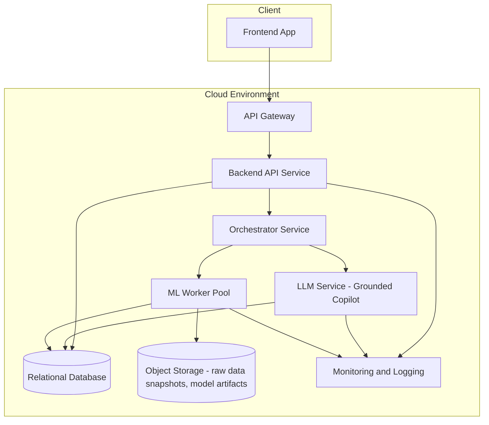

# System Design Document
## Loan Performance Intelligence Engine

---

## 1. Architecture Overview

LPIE follows a layered architecture: a frontend for human interaction, a backend API for business logic and access control, an orchestrator that sequences pipeline stages, an ML layer that performs the actual data intelligence and prediction work, a database layer for persistence, and an LLM layer that sits alongside (not inside) the prediction path to provide grounded, governed reviewer assistance.

**Key design principle:** the LLM Layer is reachable only through the Orchestrator, and only ever *reads* ML outputs and reference data — it has no path to write predictions, override scores, or bypass the ML Pipeline. This enforces the "ML-first, LLM-assists" requirement structurally, not just by convention.

---

## 2. Frontend Layer

**Responsibilities:**
- **Dashboard**: Portfolio-level overview — risk concentration, data-quality trend, model health indicators.
- **Charts**: Distribution plots, drift charts, event/survival curves, scenario comparison charts, calibration plots.
- **Reports**: Rendered views of the data intelligence report, explainability report, scenario report, and model card, plus per-loan review screens with drill-down explanations.

The frontend is a pure consumer of the Backend API — it holds no business logic or direct database/model access, which keeps the system's decision logic centralized and auditable.

---

## 3. Backend API Layer

**Responsibilities:**
- **APIs**: REST endpoints for data upload, triggering pipeline runs, fetching predictions/anomalies/scenarios/explanations, and managing the reviewer queue.
- **Business logic**: Request validation, role-based authorization checks, translating frontend actions (e.g., "accept reviewer note") into orchestrator commands or database writes.
- **Authentication**: User identity, session management, and role assignment (analyst / risk manager / ML engineer / administrator).

The backend never performs model inference or LLM calls directly — it delegates both to the Orchestrator, keeping the API layer thin and stateless.

---

## 4. Orchestrator

The Orchestrator sequences and coordinates every pipeline run. It is the only component permitted to invoke both the ML Pipeline and the LLM Layer, and it is responsible for enforcing execution order (e.g., predictions must exist before a reviewer summary can be generated) and for writing a run-level audit record.

---

## 5. ML Layer

**Responsibilities:**
- **Training**: Time-aware model training for delinquency, default, prepayment, next-state, survival/transition, and anomaly-detection models; class-imbalance handling and probability calibration.
- **Prediction**: Batch and on-demand inference over the current data snapshot, producing probabilities, anomaly scores, and exception classifications.
- **Evaluation**: Metric computation (ROC-AUC, PR-AUC, F1, recall at fixed precision, Brier score, macro-F1), drift comparison between train and test/production data, and calibration diagnostics.

Sub-components:
- **Data Intelligence Module** — profiling, missingness, outlier and relationship-break detection, data-quality scoring.
- **Prediction Module** — supervised models (e.g., gradient-boosted trees) per target outcome.
- **Survival/Transition Module** — time-to-event or monthly transition modeling with censoring handling.
- **Anomaly Module** — unsupervised/semi-supervised scoring combined with deterministic validation rules.
- **Scenario Module** — applies macro scenario assumptions to trained models to project stressed outcomes.
- **Explainability Module** — SHAP/feature-importance computation, uncertainty estimation.

---

## 6. Database Layer

**Responsibilities:**
- **Loan storage**: Static attributes and monthly performance panel data, versioned by ingestion snapshot.
- **Predictions**: Per-loan, per-model probability outputs, anomaly scores, exception classifications, and scenario projections, each tagged with the model version that produced them.
- **Logs**: Pipeline run history, data-quality scores over time, and the full LLM prompt/response audit trail (prompt, model, timestamp, retrieved context, output, human accept/reject decision).

A relational store is used for structured loan data, predictions, and audit logs, with clear foreign-key relationships between a loan, its snapshot, its predictions, and any associated reviewer actions — this is what makes every number in the system traceable back to its source.

---

## 7. LLM Layer

**Responsibilities:**
- **RAG**: Retrieval over the data dictionary and validation rules, so generated explanations are grounded in actual field definitions and rule logic rather than the model's own assumptions.
- **Summaries**: Natural-language summarization of a loan's or portfolio's ML outputs (predictions, anomaly flags, scenario results).
- **Reviewer assistance**: Drafting reviewer notes and answering natural-language questions about a loan, always citing the underlying prediction/explanation data it was grounded on.

Every LLM output is labeled as a recommendation and stored with its full grounding context, so a reviewer or auditor can trace exactly what data justified the generated text.

---

## 8. Data Flow

1. **Data ingestion** — CSV files (`loan_monthly_performance`, `loan_static_attributes`, `servicer_updates`, `macro_scenarios`) are uploaded and assigned a versioned snapshot ID.
2. **Validation** — schema checks, missingness/outlier detection, cross-field consistency checks, and source-conflict detection against `servicer_updates` produce record- and batch-level data-quality scores.
3. **Feature engineering** — static and monthly features are joined, time-aware windows are constructed, and engineered features (e.g., rolling delinquency counts, balance trends) are generated for both prediction and survival modeling.
4. **Model inference** — trained models produce delinquency/default/prepayment/next-state probabilities, survival/transition curves, and anomaly scores, all tagged with model version.
5. **Explanation generation** — SHAP/feature-importance computation runs against inference outputs to produce global and per-loan explanations, confidence/uncertainty estimates, and anomaly drivers.

The LLM Copilot only engages after step 5, consuming its outputs — it never precedes or substitutes for them.

---

## 9. Deployment Architecture

- **API Gateway** handles auth termination, rate limiting, and routing to the Backend API.
- **Backend API Service** is stateless and horizontally scalable behind the gateway.
- **Orchestrator Service** manages pipeline run state and dispatches work to the ML Worker Pool and LLM Service asynchronously (queued jobs), so large batch scoring (250K–1M+ rows) does not block interactive API requests.
- **ML Worker Pool** is horizontally scalable compute (e.g., containerized workers) for training and batch inference, with model artifacts persisted to object storage and versioned.
- **LLM Service** wraps the retrieval-augmented generation logic and enforces the "recommendation-only, logged" contract before any output reaches the database.
- **Relational Database** stores loan data, predictions, scenario outputs, and audit logs; **Object Storage** stores raw data snapshots and serialized model artifacts for reproducibility.
- **Monitoring and Logging** tracks pipeline health, data-quality trend, model drift, and LLM usage/audit metrics across all services.
